# CI 7204 Image Processing and Analytics — Challenge 2
**Object Detection in Video**

> Student: Narubet Intaraprasit | 6710422003 |

---

## Algorithm Overview

All cases use the same pipeline:

```
Template Image
     │
     ▼
[1] SIFT Feature Extraction
     │  contrastThreshold, edgeThreshold, sigma, nfeatures
     ▼
[2] FLANN Matching (KD-Tree)
     │  Find k=2 nearest neighbors for each descriptor
     ▼
[3] Lowe's Ratio Test
     │  keep match if  d1 < RATIO × d2
     ▼
[4] RANSAC Homography  (cv2.findHomography)
     │  filter geometric outliers → 3×3 matrix H
     ▼
[5] Perspective Transform  (cv2.perspectiveTransform)
     │  project template corners → bounding box in video frame
     ▼
     Output Video with bounding box
```

Multi-detect cases add an **Iterative Homography** loop:
remove inlier keypoints after each detection → repeat until `MAX_DETECTIONS` or no more matches.

---

## Project Structure

```
homework_2/
├── utils/common.py                      # shared pipeline
├── case_success/
│   ├── easy/                            # Easy cases #1-5
│   └── difficult/                       # Difficult cases #1-5
├── case_failed/
│   ├── failed_as_expected/              # Failed as Expected #1-5
│   └── failed_but_unexpected/           # Failed but Unexpected #1-5
├── cases_multi_difficult/               # Multi-detect bonus
└── run_multi_detect_difficult.py
```

---

## Easy Cases (5 cases)

> Objects with flat surfaces, rich texture, good lighting — standard SIFT parameters work.

| # | Template | Script | Params | Video | Analysis |
|---|----------|--------|--------|-------|----------|
| 1 | 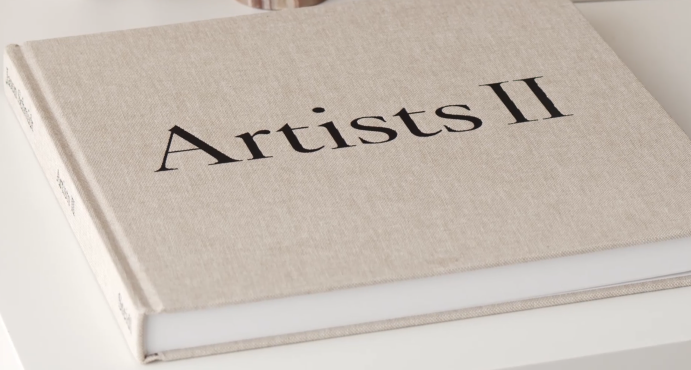 | [run_easy_1.py](case_success/easy/run_easy_1.py) | MIN=10, ratio=0.75, RANSAC=5.0 | [](https://drive.google.com/drive/u/2/folders/1NUF8AAoYTcbyigi2wUK671IqQGNReujZ) | [ANALYSIS_easy_1.txt](case_success/easy/ANALYSIS_easy_1.txt) |
| 2 | 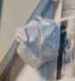 | [run_easy_2.py](case_success/easy/run_easy_2.py) | MIN=10, ratio=0.75, RANSAC=5.0 | [](https://drive.google.com/drive/u/2/folders/1NUF8AAoYTcbyigi2wUK671IqQGNReujZ) | [ANALYSIS_easy_2.txt](case_success/easy/ANALYSIS_easy_2.txt) |
| 3 | 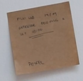 | [run_easy_3.py](case_success/easy/run_easy_3.py) | MIN=10, ratio=0.75, RANSAC=5.0 | [](https://drive.google.com/drive/u/2/folders/1NUF8AAoYTcbyigi2wUK671IqQGNReujZ) | [ANALYSIS_easy_3.txt](case_success/easy/ANALYSIS_easy_3.txt) |
| 4 |  | [run_easy_4.py](case_success/easy/run_easy_4.py) | MIN=10, ratio=0.75, RANSAC=5.0 | [](https://drive.google.com/drive/u/2/folders/1NUF8AAoYTcbyigi2wUK671IqQGNReujZ) | [ANALYSIS_easy_4.txt](case_success/easy/ANALYSIS_easy_4.txt) |
| 5 | 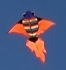 | [run_easy_5.py](case_success/easy/run_easy_5.py) | MIN=10, ratio=0.75, RANSAC=5.0 | [](https://drive.google.com/drive/u/2/folders/1NUF8AAoYTcbyigi2wUK671IqQGNReujZ) | [ANALYSIS_easy_5.txt](case_success/easy/ANALYSIS_easy_5.txt) |

**Why Easy succeeds:** Flat, textured surface → stable SIFT keypoints across viewpoints.
Default params (ratio=0.75, RANSAC=5.0) are sufficient. H model fully satisfied.

---

## Difficult Cases (5 cases)

> Objects with challenging conditions — required parameter tuning to succeed.

| # | Template | Challenge | Script | Key Params | Video | Analysis |
|---|----------|-----------|--------|-----------|-------|----------|
| 1 | 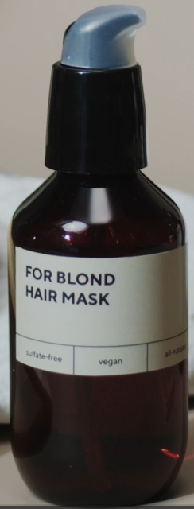 | Non-rigid deformation (clothing/fabric) | [run_difficult_1.py](case_success/difficult/run_difficult_1.py) | MIN=8, ratio=0.78, RANSAC=8.0, ct=0.02 | [](https://drive.google.com/drive/u/2/folders/1evHgkmK-fZOUBZtfmDzfCthEwYrt6rdw) | [ANALYSIS_difficult_1.txt](case_success/difficult/ANALYSIS_difficult_1.txt) |
| 2 | 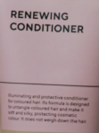 | Multiple similar objects + curved bottle | [run_difficult_2.py](case_success/difficult/run_difficult_2.py) | MIN=8, ratio=0.78, RANSAC=10.0, ct=0.02 | [](https://drive.google.com/drive/u/2/folders/1evHgkmK-fZOUBZtfmDzfCthEwYrt6rdw) | [ANALYSIS_difficult_2.txt](case_success/difficult/ANALYSIS_difficult_2.txt) |
| 3 | 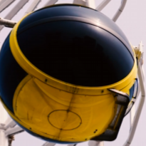 | Partial occlusion | [run_difficult_3.py](case_success/difficult/run_difficult_3.py) | MIN=8, ratio=0.78, RANSAC=8.0, ct=0.02 | [](https://drive.google.com/drive/u/2/folders/1evHgkmK-fZOUBZtfmDzfCthEwYrt6rdw) | [ANALYSIS_difficult_3.txt](case_success/difficult/ANALYSIS_difficult_3.txt) |
| 4 |  | Low-light condition | [run_difficult_4.py](case_success/difficult/run_difficult_4.py) | MIN=8, ratio=0.80, RANSAC=8.0, ct=0.01 | [](https://drive.google.com/drive/u/2/folders/1evHgkmK-fZOUBZtfmDzfCthEwYrt6rdw) | [ANALYSIS_difficult_4.txt](case_success/difficult/ANALYSIS_difficult_4.txt) |
| 5 | 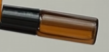 | Small object / scale mismatch | [run_difficult_5.py](case_success/difficult/run_difficult_5.py) | MIN=8, ratio=0.78, RANSAC=8.0, ct=0.02 | [](https://drive.google.com/drive/u/2/folders/1evHgkmK-fZOUBZtfmDzfCthEwYrt6rdw) | [ANALYSIS_difficult_5.txt](case_success/difficult/ANALYSIS_difficult_5.txt) |

### Why each case is difficult

| # | Root Difficulty | How Solved |
|---|-----------------|------------|
| 1 | Non-rigid fabric deformation violates H planarity assumption | Lower MIN_MATCH + looser RANSAC to tolerate distortion |
| 2 | Multiple similar conditioner bottles confuse FLANN; curved surface → reprojection error | Very high RANSAC=10.0; select keypoints only on label area |
| 3 | Object partially blocked → only ~60% of keypoints visible | Low MIN_MATCH=8; rely on remaining visible keypoints |
| 4 | Low contrast in dark scene → SIFT misses features at default threshold | contrastThreshold=0.01 (very sensitive); RATIO=0.80 |
| 5 | Object occupies few pixels → scale pyramid cannot build stable extrema | Increase nfeatures; lower contrastThreshold=0.02 |

---

## Failed as Expected (5 cases)

> Objects where SIFT is fundamentally unsuitable — failure was predicted from the start.

| # | Template | Object Type | Root Cause | Script | Video | Analysis |
|---|----------|-------------|------------|--------|-------|----------|
| 1 | 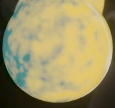 | Plain/uniform surface (white paper / blank wall) | No texture → 0 SIFT keypoints | [run_failed_expected_1.py](case_failed/failed_as_expected/run_failed_expected_1.py) | [](https://drive.google.com/drive/u/2/folders/1nVR10OEi3a_08nwpq-yE87hFtmMXTyyx) | [FAILURE_ANALYSIS_1.txt](case_failed/failed_as_expected/FAILURE_ANALYSIS_1.txt) |
| 2 |  | Solid-color fabric (plain black/dark shirt) | Uniform color → no gradient → no keypoints | [run_failed_expected_2.py](case_failed/failed_as_expected/run_failed_expected_2.py) | [](https://drive.google.com/drive/u/2/folders/1nVR10OEi3a_08nwpq-yE87hFtmMXTyyx) | [FAILURE_ANALYSIS_2.txt](case_failed/failed_as_expected/FAILURE_ANALYSIS_2.txt) |
| 3 | 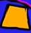 | Reflective surface (mirror / metallic spoon) | Specular highlights change with viewpoint → descriptor mismatch | [run_failed_expected_3.py](case_failed/failed_as_expected/run_failed_expected_3.py) | [](https://drive.google.com/drive/u/2/folders/1nVR10OEi3a_08nwpq-yE87hFtmMXTyyx) | [FAILURE_ANALYSIS_3.txt](case_failed/failed_as_expected/FAILURE_ANALYSIS_3.txt) |
| 4 |  | Transparent object (clear glass / plastic bottle) | Keypoints come from background, not object → unstable | [run_failed_expected_4.py](case_failed/failed_as_expected/run_failed_expected_4.py) | [](https://drive.google.com/drive/u/2/folders/1nVR10OEi3a_08nwpq-yE87hFtmMXTyyx) | [FAILURE_ANALYSIS_4.txt](case_failed/failed_as_expected/FAILURE_ANALYSIS_4.txt) |
| 5 | 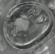 | Repetitive pattern (tiles / brick / checkerboard) | Descriptor ambiguity — every tile matches every other tile | [run_failed_expected_5.py](case_failed/failed_as_expected/run_failed_expected_5.py) | [](https://drive.google.com/drive/u/2/folders/1nVR10OEi3a_08nwpq-yE87hFtmMXTyyx) | [FAILURE_ANALYSIS_5.txt](case_failed/failed_as_expected/FAILURE_ANALYSIS_5.txt) |

### Techniques that would help

| # | Recommended Technique |
|---|----------------------|
| 1 | Shape/Contour matching (cv2.matchShapes), Template matching by silhouette |
| 2 | Color segmentation (HSV thresholding), Deep embedding (CNN global feature) |
| 3 | Photometric-invariant descriptors (DAISY, LIOP), polarization camera |
| 4 | Silhouette detection (Canny edge on rim), Depth camera / Structured light |
| 5 | Global feature descriptor (HOG, Color Histogram), VLAD / Fisher Vector |

---

## Failed but Unexpected (5 cases)

> Objects that appeared to have enough texture for SIFT — but still failed due to subtle reasons.

| # | Template | Object | Root Cause (Unexpected) | Script | Video | Analysis |
|---|----------|--------|------------------------|--------|-------|----------|
| 1 | 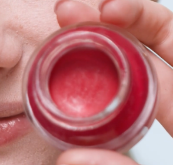 | Small red cosmetic jar (lip balm, lid open) | Curved surface violates H planarity; open lid changes appearance | [run_failed_unexpected_1.py](case_failed/failed_but_unexpected/run_failed_unexpected_1.py) | [](https://drive.google.com/drive/u/2/folders/1bI7kM6HstJRBhL-iNYMPtB_4TkaH80Wl) | [FAILURE_ANALYSIS_1.txt](case_failed/failed_but_unexpected/FAILURE_ANALYSIS_1.txt) |
| 2 | 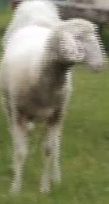 | Single white sheep in moving flock of 20+ | Low-texture wool + identical individuals → SIFT cannot distinguish target | [run_failed_unexpected_2.py](case_failed/failed_but_unexpected/run_failed_unexpected_2.py) | [](https://drive.google.com/drive/u/2/folders/1bI7kM6HstJRBhL-iNYMPtB_4TkaH80Wl) | [FAILURE_ANALYSIS_2.txt](case_failed/failed_but_unexpected/FAILURE_ANALYSIS_2.txt) |
| 3 | 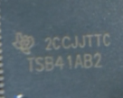 | Logo on product seen from distance | Template high-res vs logo <50px in video → scale pyramid fails | [run_failed_unexpected_3.py](case_failed/failed_but_unexpected/run_failed_unexpected_3.py) | [](https://drive.google.com/drive/u/2/folders/1bI7kM6HstJRBhL-iNYMPtB_4TkaH80Wl) | [FAILURE_ANALYSIS_3.txt](case_failed/failed_but_unexpected/FAILURE_ANALYSIS_3.txt) |
| 4 | 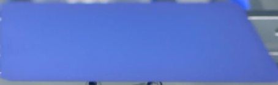 | Detailed artwork / painting under dynamic lighting | SIFT gradient normalization cannot handle extreme illumination change | [run_failed_unexpected_4.py](case_failed/failed_but_unexpected/run_failed_unexpected_4.py) | [](https://drive.google.com/drive/u/2/folders/1bI7kM6HstJRBhL-iNYMPtB_4TkaH80Wl) | [FAILURE_ANALYSIS_4.txt](case_failed/failed_but_unexpected/FAILURE_ANALYSIS_4.txt) |
| 5 |  | Book cover in cluttered bookshelf | Correct RANSAC, Wrong Object — neighbor books have similar local features | [run_failed_unexpected_5.py](case_failed/failed_but_unexpected/run_failed_unexpected_5.py) | [](https://drive.google.com/drive/u/2/folders/1bI7kM6HstJRBhL-iNYMPtB_4TkaH80Wl) | [FAILURE_ANALYSIS_5.txt](case_failed/failed_but_unexpected/FAILURE_ANALYSIS_5.txt) |


## How to Run

```bash
# Install dependencies
pip install opencv-python opencv-contrib-python numpy

# Run any case
python case_success/easy/run_easy_.py
python case_success/difficult/run_difficult_.py
python case_failed/failed_as_expected/run_failed_expected_.py
python case_failed/failed_but_unexpected/run_failed_unexpected_.py

```
---
| Case | Drive Link |
|------|-----------|
| Easy 1–5 | *(upload output videos → paste link)* |
| Difficult 1–5 | *(upload output videos → paste link)* |
| Failed Expected 1–5 | *(upload output videos → paste link)* |
| Failed Unexpected 1–5 | *(upload output videos → paste link)* |
| Multi-Detect | *(upload output video → paste link)* |

---

*CI 7204 Image Processing and Analytics — Narubet Intaraprasit*


